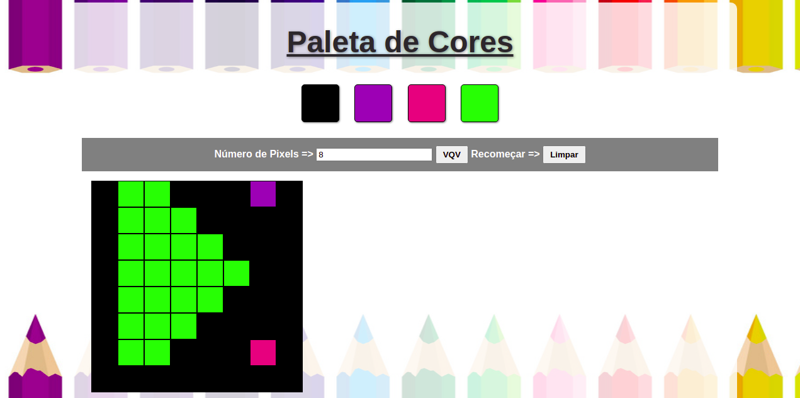

# PixelArt
PixelArt Bloco5/Trybe

https://carolsi-hub.github.io/Trybe-PixelArt/   

  
Projeto2 da śerie de 3 projetos final bloco_5/Trybe.
O objetivo era criar um board de Pixels, com interações pré-definidas com o usuário. 
A aplicação permite o usuário escolher uma cor (gerada de forma randomica), selecionar o tamanho do board e fazer qualquer desenho.

#### Tecnologias: 
- JavaScript Vanilla
- HTML 5
- CSS

//As imagens não possuem fins comerciais

This is the second project of a seriall of 3, at the end of 5 step/Trybe. 
The app is a Pixel Board, where the user can pic a color (randomly generated), select the size os the board and make any draw.
